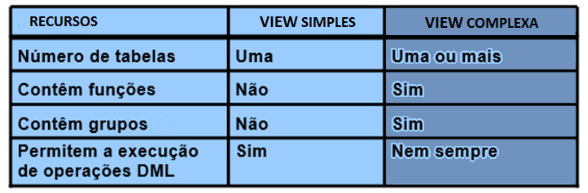

# Aula 11 - Views

## Visão (view)

Uma view corresponde ao conjunto de tuplas resultantes de uma consulta armazenada sobre uma ou mais tabelas do SGBD. Os usuários do SGBD podem utilizar a view para consultar seus conjuntos de dados.

- Uma view é uma "table lógica" baseada em uma ou mais tabelas reais existentes no SGBD ou mesmo sobre outra view;
- A view em si não contém dados, é utilizada para exibir, e até mesmo alterar, alguns dados provenientes de tabelas.
- A tabela, ou tabelas, na qual uma view é baseada é denominada tabela base;
- A view é armazenada como uma instrução SELECT no Dicionário de Dados;
- As visões não são objetos físicos do SGBD;
- Também podem ser definidas como objetos que não armazenam dados, pois não são tabelas, são compostas dinamicamente por uma consulta que é previamente analisada e otimizada pelo SGBD.

## Instrução SQL de VIEW

A instrução geral SQL (DDL) de criação de uma view:

```sql
CREATE VIEW CANDIDATOS_2022 (registro, candidato, cargo, cidade, estado) AS 
    SELECT  p.codigo, p.nome, l.cargo, l.cidade, l.sigla
    FROM    PESSOA p, LOCAL l
    WHERE   p.idPessoa = l.idPessoa
    AND     l.ano = 2022;
```

Após a criação, o novo objeto pode ser conferido por meio da instrução:

```sql
DESC CANDIDATOS_2022;
```

E as tuplas podem ser recuperadas por meio da instrução:

```sql
SELECT * 
    FROM CANDIDATOS_2022;
```

As instruções DDL também operam sobre VIEW:

```sql
CREATE VIEW ...
ALTER VIEW ...
DROP VIEW ...
```

## View simples e complexas

A diferença básica entre as views simples e completas está relacionada a realização das operações DML (INSERT, UPDATE e DELETE) pela *view*, manipulando as tabelas reais (base).



|Simples|Complexa|
|-|-|
|Deriva dados de uma única tabela;| Deriva dados de várias tabelas;|
|Não contém funções ou agrupamento de dados;|Contém funções ou agrupamento de dados;|
|Permite a execução de operações DML.|Nem sempre permite a execução de operações DML.|

## Utilidade da VIEW

- Segurança: restrição de acesso as tuplas e as colunas.
- Armazenamento de consultas complexas ou executadas com muita frequência, simplificando o sistema para o usuário e aprimorando a abstração.
- Apresentação dos dados com menor complexidade ou em diferentes perspectivas.
- Isolamento de aplicações em relação a alterações de esquema.

## Instrução SQL

### MySQL

```sql
CREATE [OR REPLACE]
[ALGORITHM = {UNDEFINED | MERGE | TEMPTABLE}]
[DEFINER = {user | CURRENT_USER}]
[SQL SECURITY {DEFINER | INVOKER}]
VIEW nome da view [(colunas)]
AS expressão SELECT
[WITH [CASCADED | LOCAL] CHECK OPTION]
```

### Oracle

```sql
CRETE [OR REPLACE]
VIEW nome da view
[(NomeColuna[, NomeColuna...])]
AS expressão SELECT
[WITH CHECK OPTION | READ ONLY];
```

## Características da view

- Operações sobre visões
  - Visões não atualizáveis (read-only)
    - Seleção;
  - Visões atualizáveis (updatable)
    - Seleção, inserção, remoção, atualização.
- Privilégios
  - Proprietário da view (owner)
    - Operações requerem privilégios adequados sobre a tabela base;
    - Podem conceder privilégios de acesso
      - o dono das tabelas base;
      - usuários que tenham recebido os privilégios com a opção grant.
  - Outros usuários: requerem privilégios para view;


