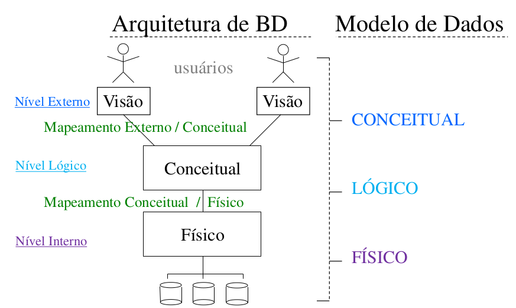
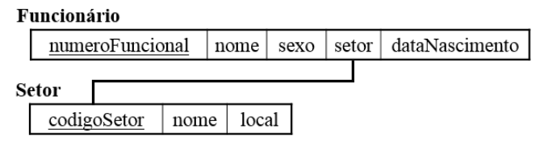
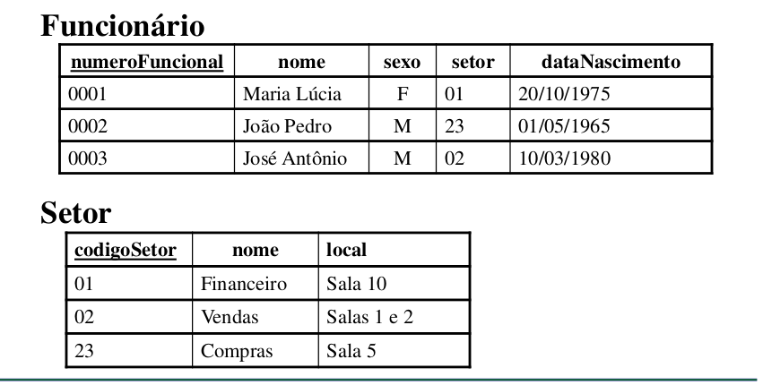

# Sistema Gerenciador de Banco de Dados - SGBD

## Características importantes do SGBD

- Controle sobre a redundância;
- Controle da concorrência no acesso aos dados;
- Controle sobre acesso aos dados;
- Fornecimento de múltiplas interfaces;
- Forçar restrições de integridade
  - São regras associadas aos dados respeita a coerência na representação do mundo real.
  - Identificação do tipo de dado, unicidade de um dado, impossibilidade de valores nulos e relacionamento entre os dados armazenados.
- Dificultar o erro.
- Sistema de *backup* e *recovery*;

## Facilidades providas pelo SGBD

| Atividade | 
 Descrição 
 |
| :-: | - |
| **Definição** | Especificar e descrever detalhadamente as estruturas e tipos de dados a serem gravados no BD. |
| **Construção** | Processo de gravar (popular) inicialmente os dados no BD. |
| **Manipulação** | Inclui funções como consultar e atualizar dados.  |

## Principais atribuições do SGBD

- Além dos dados de conteúdo armazenados, o BD também armazena definições e descrições sobre a estrutura que forma tal banco de dados (metadados);

- O catálogo do sistema (metadados) contém definições da estrutura de cada arquivo, tipo de dado e formato de armazenamento de cada item de dados, além de várias possíveis restrições.

- Este catálogo, ou dicionário, é usado pelo SGBD e ocasionalmente por algum usuário do BD.

## Diagrama de Esquema

É uma representação simplificada que pode ajudar na identificação de uma estrutura de dados (esquema) e suas inter-relações.

### Exemplo de DE

### Representação de instâncias (registros)

