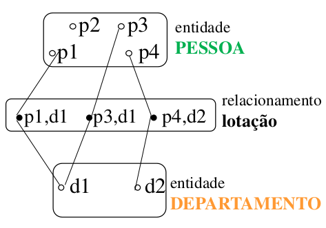
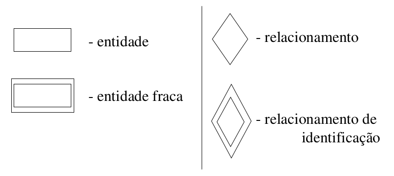
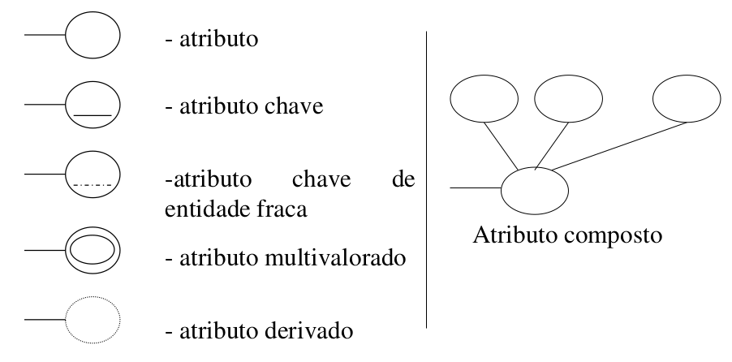
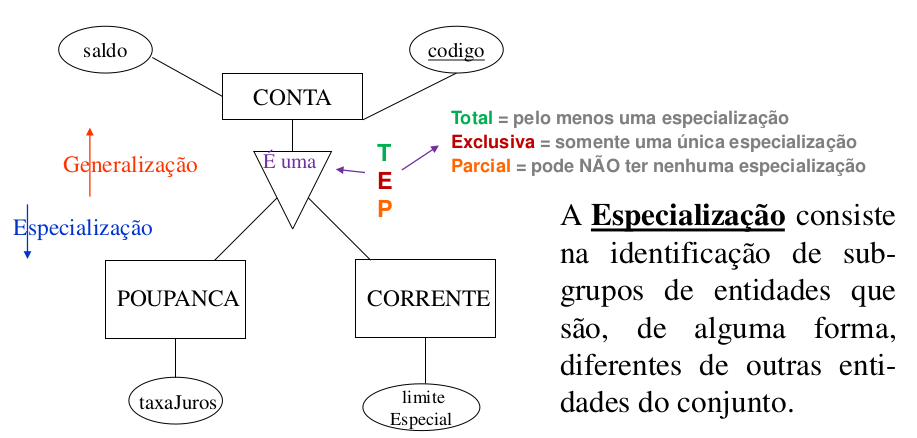
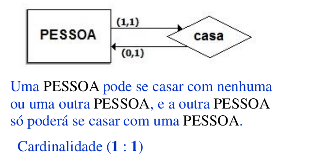
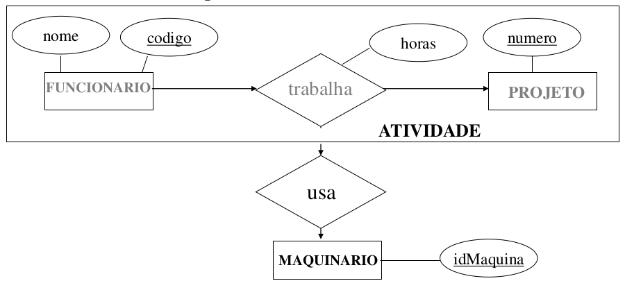
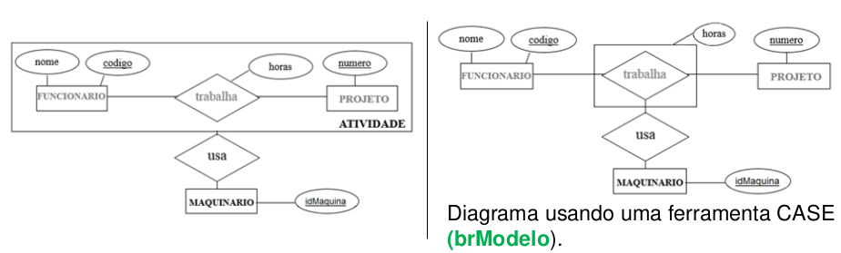
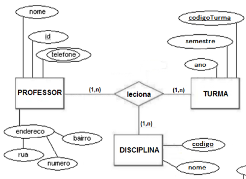
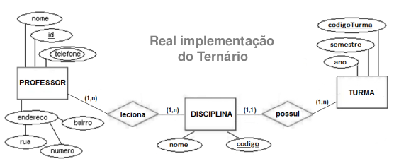
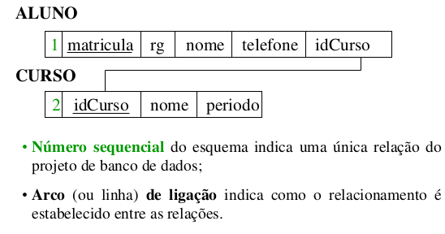

# Aula 4 - Modelo de Entidade Relacionamento

## Modelo Entidade-Relacionamento (ME-R)

O Modelo Entidade-Relacionamento (ME-R) é composto por **entidades**, que são conjuntos de objetos básicos, e os **relacionamentos** entre estes objetos.

O ME-R foi desenvolvido para facilitar o projeto de BD, permitindo a especificação de um esquema de "negócio", onde tal esquema representa a estrutura lógica geral do BD.

## Entidade

Conceito fundamental da abordagem entidade-relacionamento (E-R).

- Conjunto de objetos da realidade modelada sobre os quais deseja-se colecionar dados no banco de dados;
- Pode ser concreta (pessoa) ou abstrata (curso);
- Uma entidade representa um conjunto de objetos dos quais que se deseja guardar dados e é importante para o seu mundo real.

Exemplo: Em um sistema bancário as entidades podem ser: clientes, contas correntes, cheques, agências, dentre outros. Sendo que cliente representa o conjunto de clientes dos quais se deseja manter dados no banco de dados.

### Classificação das entidades

- Entidades fortes: não dependem de outras entidades para existirem;
- Entidades fracas: dependem de outra entidades para existirem. O relacionamento com essa outra entidade é um **relacionamento de identificação**;
- Entidades associativas: abstração por meio da qual relacionamentos são tratados como entidades.

## Relacionamento

O conjunto de associações entre as Entidades.

- É a coleção de ocorrências das entidades relacionadas (associadas);
- A função que uma entidade exerce em um relacionamento é chamada de papel;
- Também pode ter atributos descritivos (por exemplo data e hora onde ocorre tal relacionamento);
- A ocorrência de um relacionamento particular dentro de um conjunto de relacionamentos de um mesmo tipo é chamada de instância do relacionamento.

Exemplo:

Suponha o relacionamento lotação entre as entidades DEPARTAMENTO e PESSOA.

- Entidades: DEPARTAMENTO e PESSOA
- Relacionamento: lotação

## Diagrama de Ocorrência

A elaboração desse diagrama facilita o entendimento sobre um determinado relacionamento e as entidades envolvidas.
<center>


</center>

As ocorrências são representadas por círculos brancos (entidades) e pretos (relacionamentos). As linhas que interligam os pontos representam a ocorrência de participantes de relacionamentos.

## Atributo

O dado que é associado a cada ocorrência de uma entidade ou um relacionamento.

- Uma entidade é representada por um único ou vários atributos;
- Para cada atributo existe um conjunto de valores permitidos, chamado **domínio** daquele atributo;
- O atributo mapeia uma entidade em um domínio.

Exemplo: Cliente - cada ocorrência de cliente conterá os seus atributos CLIENTE **(nome, CPF, telefone, endereço)**.

## Dependência de Existência

- Considere os conjuntos de entidade CONTA e TRANSAÇÃO, com o relacionamento lançamento entre estes conjuntos;
- Caso um registro da entidade CONTA seja apagada, todas as suas transações também deverão ser;
- Porém se uma TRANSAÇÃO for apagada, nada acontecerá com o registro da entidade CONTA especificada;
- A entidade CONTA é dominante e a TRANSAÇÃO é subordinada (ou dependente de CONTA).

## Chave

É um ou mais atributos que permitem identificar unicamente uma entidade no conjunto de registros da entidade.

- Chave candidata é o atributo, ou a composição de atributos, que *pode* identificar unicamente uma entidade;
- Chave primária define a chave candidata **escolhida** pelo projetista de dados para identificar os registros de uma entidade.

## Diagrama Entidade-Relacionamento

A estrutura lógica geral de um BD pode ser representada graficamente por um Diagrama de Entidade-Relacionamento (DE-R), que é composto por:

- Entidades: representadas por retângulos;
- Atributos: representados por elipses;
- Relacionamentos: representados por losangos;
- Ligações entre atributos e relacionamentos: representados por linhas.

## Cardinalidade

Restrição de mapeamento que expressa o número de entidades às quais outra entidade pode ser associada por meio de um conjunto de relacionamentos.

A cardinalidade para o relacionamento entre as entidades A e B pode ser:

- Um para um (1:1): uma entidade de A está associada a uma única entidade de B, e uma entidade de B está associada a uma única entidade de A.
- Um para muitos (1:n): uma entidade de A está associada a qualquer quantidade da entidade B, e uma entidade de B está associada a uma única entidade de A.
- Muitos para um (n:1): uma entidade de A está associada a uma única entidade de B, e uma entidade de B pode estar associada a qualquer quantidade de entidades de A.
- Muitos para muitos (n:m): uma entidade de A está associada a qualquer quantidade da entidade B, e uma entidade de B pode estar associada a qualquer quantidade de entidades de A.

### Notação utilizada no DE-R

#### Nomenclatura no DE-R

- Entidade: geralmente *substantivo* escrito em *maiúsculo*;
- Relacionamento: *verbo significativo* ao relacionamento existente entre as entidades participantes;
- Atributo: geralmente substantivo significativo. É escrito em minúsculo;
- Não utilizar acentos e evitar underline.

#### Símbolos

<center>




</center>

## Generalização e especialização

A **generalização** é usada para enfatizar as semelhanças entre os tipos de entidade de nível superior e ocultar suas diferenças.
<center>


</center>

## Autorrelacionamento

Envolve apenas uma entidade e respeita as cardinalidades estudadas.
<center>


</center>

## Agregação

No ME-R não é possível expressar relacionamentos entre relacionamentos. Para fazer essa representação utiliza-se agregação, ou **entidade associativa**, que é uma abstração pela qual relacionamentos são tratadas como entidades.

O relacionamento trabalha e as entidades FUNCIONARIO e PROJETO são tratadas como um conjunto de entidades de nível superior: ATIVIDADE.
<center>


</center>

Uma entidade associativa pode ser representada de duas formas no DE-R:
<center>


</center>

## Relacionamentos ternários

A representação do relacionamento entre três entidades pode ser feito de forma mais objetiva no DE-R.
<center>


</center>

Mas a implementação do relacionamento ternário é dada por:
<center>


</center>

## Descrição da Relação

Um banco que esteja de acordo com o DE-R pode ser representado por uma coleção de tabelas. Para cada conjunto de entidades e relacionamentos, no BD, podem existir uma ou mais tabelas que possuem, normalmente, o mesmo nome dos seus objetos correspondentes.

- Organização das tabelas:

  - Entidade ou Entidade Forte - uma tabela específica

  - Entidade Fraca - uma tabela com o atributo chave da forte

  - Relacionamentos (fraca x forte) - atributos serão redundantes

O diagrama de esquemas pode ser usado para representar as entidades e seus atributos. Ele é uma representação simplificada que identifica um esquema e suas inter-relações.

<center>


</center>

## Descrição dos esquemas

Os esquemas podem ser descritos para posterior implementação física. A descrição desses esquemas possui **sintaxe** e **semântica** específica. A descrição tem por objetivo descrever os **tipos de dados** e principais **restrições** que serão implementadas no nível de armazenamento dos dados.

| Tipos de dado | Sintaxe | Exemplo |
| --- | --- | --- |
| Numérico | `numérico(n,d)` | `-45.57` |
| Textual | `literal(n)`| `'porcelana'` |
| Data | `data` | `23/12/2001`|
| Horário | `horário` | `10:32:51` |

- `n` corresponde ao comprimento ou tamanho do valor.
- `d` corresponde à quantidade de dígitos após a vírgula.

A obrigatoriedade de um atributo é identificada na descrição do esquema pela expressão **NÃO NULO**.

Na descrição do esquema também pode ser indicada a **restrição** que permite a identificação única (chave primária) de uma tupla no esquema, pois não devem existir tuplas iguais no mesmo esquema.

Sintaxe: `restrição <identificador> de Chave Primária(<atributo(s)>)`

### Exemplo

Descrição do esquema ALUNO.

Do ME-R, temos que:

ALUNO(<span style="text-decoration: underline">matricula</span>, nome, nascimento, **cpf**, **telefone**)

- Sendo que os atributos cpf e telefone não são obrigatórios.

### Descrição do esquema

```sql
ALUNO(
  matricula    numérico(8)    NÃO NULO, 
  nome         literal(30)    NÃO NULO,
  nascimento   data           NÃO NULO, 
  cpf          numérico(11), 
  telefone     numérico(12), 
restrição ALUNO_PK de Chave Primária(matricula),
);```
