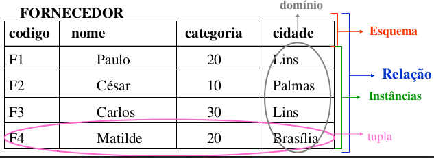

# Aula 5 - Modelo Relacional de Dados

## Esquema e instância

- Esquema: Descrição da organização dos dados de um BD.

- Instância: Registros guardados nos esquemas.

## Modelo Relacional de Dados

O modelo relacional representa os dados em um BD por meio de um conjunto de relações (tabelas).

- Tupla: cada instância do esquema.

- Esquema: conjunto de atributos que descreve as características dos elementos.

- Relação: tabela completa.

- Atributo: coluna da tabela.

- Domínio: conjunto dos valores possíveis para um atributo.

- Grau da relação: a quantidade de atributos de uma relação.

### Características das relações

- Não há tuplas duplicadas em uma relação.

- A ordem das tuplas não é relevante para diferenciá-las.

- Existem ordem dos valores nas tuplas, já que o esquema é definido como um conjunto de atributos.

- Os valores dos atributos devem ser atômicos, não sendo divisíveis em componentes.

  - Atributos multivalorados são representados por meio de **outra relação**.
  - Atributos **compostos** são pelos seus componentes.

<!-- @TODO: completar essa parte até slide 11 -->

<!-- @TODO: completar do slide 14 até 17 -->

<!-- @TODO: finalizar resumo desses slides -->