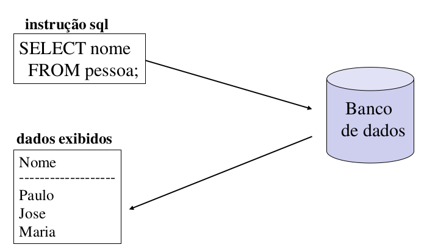

# Aula 6 - Linguagem SQL

## Structured Query Language - SQL

A linguagem SQL é declarativa e os SGBDs Relacionais a têm como padrão.

| Linguagem Declarativa (ou não procedural) | Linguagem Procedural |
| :-: | :-: |
| Descreve **o que** se deseja realizar, **como** será feito é responsabilidade do sistema. | Fornece uma descrição detalhada de **como** um processamento será realizado, operando sobre um registro ou uma unidade de dados de cada vez. |

Geralmente um SDBD Relacional proporciona dois tipos principais de recursos em sua linguagem SQL:

- DDL - Data Definition Language: específica para manipular as estruturas do BD;
- DML - Data Manipulation Language: utilizada para realizar consultas e atualizações sobre os registros armazenados nessas estruturas.

### Linguagem de Definição de Dados (DDL)

Uma estrutura de dados é representada por um conjunto de definições expressas por uma linguagem específica.

- O resultado no uso da DDL constitui em um arquivo especial chamado de dicionário ou diretório de dados;
- Um dicionário de dados é um arquivo de metadados;
- Em um SBD o dicionário de dados é consultado antes que o dado real seja manipulado.

### Linguagem de Manipulação dos Dados (DML)

É a linguagem que viabiliza o acesso ou a manipulação dos dados de forma compatível com o modelo de dados apropriado. Por manipulação, entende-se:

- Recuperação dos dados armazenados no BD;
- Inserção de novos dados no BD;
- Remoção e modificação de dados do BD.

#### Linguagem de Consulta dos Dados (SQL)

- É parte de uma DML responsável pela recuperação de dados (pesquisa ou consulta);
- É uma linguagem declarativa que permite a interface básica para comunicação com o banco de dados.

## Padrões no identificador dos atributos

- Identificador único: **id**Empregado
- Data de nascimento: **dt**Nascimento
